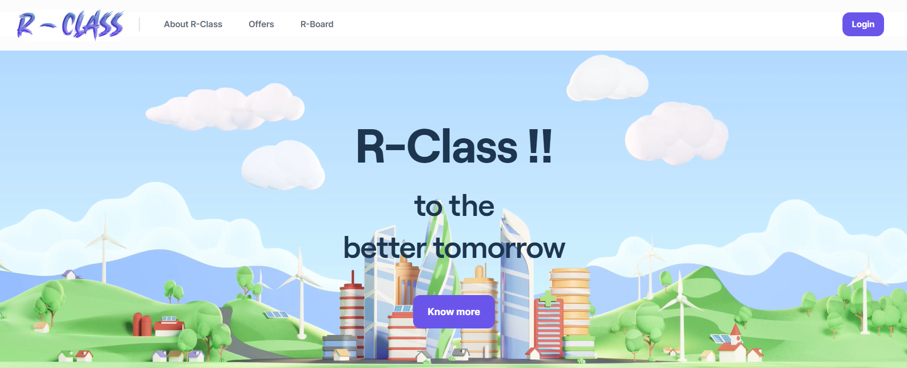

<p align="center">

</p>
<h1 align="center">
  <b>PROJECT R Class !!</b>
</h1>

<p align="center">
  Be sure to ⭐ this repo so you can keep up to date on any daily progress!
</p>

<p align="center">
    
</a>&nbsp;
<a href="https://www.python.org/" target="_blank">
    
</a>&nbsp;
    
</a>&nbsp;

</p>

<br>


## 📕 Installation


First of all, download and install [Python](https://www.python.org/downloads/) and your favourite IDE (I used [PyCharm](https://www.jetbrains.com/pycharm/download/#section=windows)). Python Version `3.6` or higher is required.
<br>

### 🕷️ Create an environment

Whatever you prefer (e.g. `conda` or `venv`)

```console
mkdir myproject
$ cd myproject
$ python3 -m venv venv
```

### 🕷️ Activate the venv folder

Windows:

```console
venv\Scripts\activate
```

Mac / Linux (Create a venv, activate it and install requirements.txt):

```console
. python3 -m venv venv
. venv/bin/activate
```

### 🕷️ Install Dependencies

Install Dependencies only for Mac/Linux:

 ```console
. pip install -r requirements.txt
 ```

<br>


### 💻 Run Project

Start cmd and type:

```bash
python manage.py runserver
```

<br>

## ⭐️ Project assistance

### 🛠️ Built With

- [Python 3.8](https://www.python.org/) - Creating Project

### ❤️ Authors

- **Shaino Sajimon** - *Design & Development* - 
- **Devanand A** - *Design & Development* - 
- **Gokul CM** - *Design & Development* -
- **Akhiljith K** - *Design & Development* - 

<br>
<br>

## 🚨 Forking this repo (please read!)

_**yes, with attribution**_.

I value keeping my work open source, but as you all know, _**plagiarism is bad**_. It's always disheartening whenever I find that someone has copied my work without giving me credit. I spent a non-trivial amount of effort building and designing this project, and I am proud of it! All I ask of you all is to not claim this effort as your own.

### TL;DR

Yes, you can fork this repo. Please give me proper credit). Thanks!
